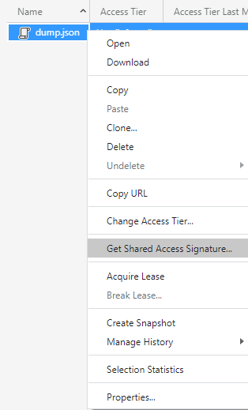
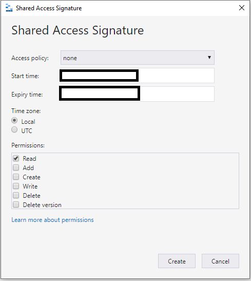
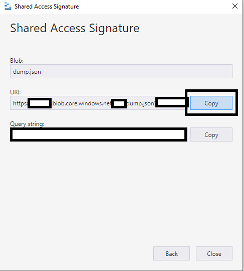

# Use Data Simulator with data dictionary and dictionaryutils

You can use **dictionaryutils** and [datadictionary](https://github.com/uc-cdis/datadictionary) along with [data-simulator repo](https://github.com/uc-cdis/data-simulator) for local testing.

You can use **dictionaryutils** to:
* load a local dictionary to a python object
* dump schemas to a file that can be uploaded to storage as an artifact
* load a schema file from a URL to a python object that can be used by services

## Setup Environment

You can use the [example](https://github.com/uc-cdis/datadictionary) repo for this sample.

```console
git clone https://github.com/uc-cdis/datadictionary.git
```

You can use the cloned repository's directory as the **working directory** for the following tasks.

You can also clone the [data-simulator repo](https://github.com/uc-cdis/data-simulator):

```console
https://github.com/uc-cdis/data-simulator.git
```

### Set up an Azure Storage Account

You can [install Azure CLI](https://docs.microsoft.com/en-us/cli/azure/install-azure-cli) to set up an Azure Storage Account and add it to an [Azure Subscription](https://azure.microsoft.com/).

Assuming that we have an Azure subscription, use az cli to login and set the subscription:

```console
az login
az account set -s 'my-subscription-id'
```

You can create a resource group to host the storage account:

```console
az group create -l westus -n MyStorageRG
```

You can create storage account to host [blobs](https://azure.microsoft.com/en-us/services/storage/blobs/).

```console
az storage account create -n mystorageaccount -g MyStorageRG -l westus --sku Standard_LRS
```

You can also retrieve the **Storage Account Connection String**, which can be used to connect to the storage account:

```console
$connectionString = $(az storage account show-connection-string -g MyStorageRG -n MyStorageAccount --query "connectionString" -o tsv)
```

You can use the connection string to create a container to store schemas and other files:

```console
az storage container create --public-access off --connection-string $connectionString -n "myschemas"
```

> For convenience with viewing the storage account, you can also use [Azure Storage Explorer](https://azure.microsoft.com/en-us/features/storage-explorer/) to check on the contents of the storage account.
Use the **Storage Account Connection String** to view the storage account with [Storage Explorer](https://docs.microsoft.com/en-us/azure/vs-azure-tools-storage-manage-with-storage-explorer?tabs=windows#use-a-connection-string).

The container will be used later for uploading schema files.

### Setup Data dictionary

Within the **datadictionary** cloned repo, set up a python virtual environment. 

```console
python -m venv my-venv
. my-venv/bin/activate
```

Next, install python dependencies.  Copy the following to a **requirements.txt** file:

```console
attrs==20.3.0
cdislogging==1.0.0
certifi==2020.12.5
chardet==3.0.4
dictionaryutils==3.2.0
gen3dictionary==2.0.1
idna==2.10
jsonschema==3.2.0
pyrsistent==0.17.3
PyYAML==5.3.1
requests==2.25.0
six==1.15.0
urllib3==1.26.2
```

Then install using pip:

```console
python3 -m pip install -r requirements.txt
```

> When not using the **datadictionary** repo, be sure to `deactivate` the virtual environment.

The **datadictionary** repo has an example schema under [datadictionary/gdcdictionary/schemas](https://github.com/uc-cdis/datadictionary/tree/develop/gdcdictionary/schemas) which can be used to generate samples based on the schema.  Using the sample schema will be covered in detail later in this guide.

### Setup Data-Simulator

Within the `data-simulator` cloned repo, set up a python virtual environment. 

```console
python -m venv my-venv
. my-venv/bin/activate
```

Poetry needs to be installed before installing data simulator.
Please follow https://python-poetry.org/docs/#installation for installing poetry.

> The shell environment may need to be refreshed or restarted after installing poetry.

To install data simulator, run the following command in the `data-simlator` cloned repo folder.

```console
poetry install -vv
```

After installation of `data-simulator`, you should be able to validate a successful installation by using the following command:

```console
data-simulator -h
```

## Use dictionaryutils to load a dictionary

You can use python to load a data dictionary.

```python
from dictionaryutils import DataDictionary

dict_fetch_from_remote = DataDictionary(url=URL_FOR_THE_JSON)

dict_loaded_locally = DataDictionary(root_dir=PATH_TO_SCHEMA_DIR)
```

You can use the [datadictionary/gdcdictionary/schemas](https://github.com/uc-cdis/datadictionary/tree/develop/gdcdictionary/schemas) folder which should be available from cloning the repository earlier.

```python
from dictionaryutils import DataDictionary
dict_loaded_locally = DataDictionary(root_dir="../datadictionary/gdcdictionary/schemas")
```

## Use dictionaryutils to dump a dictionary

You can also dump the [datadictionary/gdcdictionary/schemas](https://github.com/uc-cdis/datadictionary/tree/develop/gdcdictionary/schemas) to a file.

The schema should be available from cloning the [datadictionary](https://github.com/uc-cdis/datadictionary/) repository earlier.

```python
import json
from dictionaryutils import dump_schemas_from_dir

with open('dump.json', 'w') as f:
    json.dump(dump_schemas_from_dir('../datadictionary/gdcdictionary/schemas/'), f)
```

In this case, the dumped JSON file should have the combined schema.

The **dump.json** file can be used with the [data-simulator](https://github.com/uc-cdis/data-simulator).

## Use Data Simulator to test a schema

Data Simulator can use a URL to test a schema.  

### Upload the dumped schema file into Azure Storage

Assuming that the [Azure Blob storage account](https://azure.microsoft.com/en-us/services/storage/blobs/) is set up and the **dump.json** is available, you can use Azure Storage Explorer to [upload the schema file to a blob container](https://docs.microsoft.com/en-us/azure/storage/blobs/storage-quickstart-blobs-storage-explorer#upload-blobs-to-the-container).

> Or for convenience, with Azure Storage Explorer open and the **dump.json** file available, you can also drag and drop the **dump.json** file into the placeholder Azure Blob Storage Container created earlier.

You can obtain URL for the schema in a couple of ways with Azure Storage.

### Use Azure CLI to generate a SAS URL

You can use Azure CLI and `bash` to generate a SAS token URL for the **dump.json** that was just uploaded into blob storage.

```console
storageAccountName="andysa"
containerName="gdc"
blobName="dump.json"
end=$(date -u -d "30 minutes" '+%Y-%m-%dT%H:%MZ')

sasToken=$(az storage blob generate-sas -c $containerName -n $blobName --permissions r --expiry $end --https-only --connection-string $connect
ionString -o tsv)

schemaSasUrl="https://$storageAccountName.blob.core.windows.net/$containerName/$blobName?$sasToken"

echo $schemaSasUrl
```

### Use Azure Storage Explorer to generate a SAS Url

You can also use Storage Explorer to generate the SAS Url using Azure Storage Explorer:

Right click on the **dump.json** blob to generate a SAS.



Configure SAS properties.  For the purposes of the guide, you can utilize Read permissions, but do be mindful to restrict the expiry time to a minimal duration of expected use.

> You can Shared Access Signatures (SAS) for getting started / testing purposes. Do note that there's additional [best practices when using SAS](https://docs.microsoft.com/en-us/azure/storage/common/storage-sas-overview?toc=/azure/storage/blobs/toc.json#best-practices-when-using-sas) to keep in mind when using SAS for your scenario.



Copy the SAS URL:



### Use Data Simulator with schema file hosted in Azure Storage

When using data-simulator, be sure to have the python `virtual environment` active in the local folder corresponding to the [data-simulator repo](https://github.com/uc-cdis/data-simulator). Verify that [poetry](https://python-poetry.org/docs/#installation) is installed.

You should have a SAS URL that has a generated SAS token for the **dump.json** file that was uploaded to Azure Storage earlier.

If the SAS token has expired, be sure to generate a new SAS token and retry the validation step.

The generated SAS URL can be used with the following commands with Data Simulator.

#### Use Data Simulator to validate hosted schema file

You can use data-simulator to validate a schema file that is uploaded into Azure Storage.

```console
data-simulator validate --url "$schemaSasUrl"
```

#### Use Data Simulator to simulate based on hosted schema file

You can use data-simulator to simulate based a schema file that is uploaded into Azure Storage.

```console
mkdir sample_test_data # Create placeholder folder if needed.
data-simulator simulate --url "$schemaSasUrl" --path "../data-simulator/sample_test_data" --program DEV --project TEST
```

#### Use Data Simulator to set up submission order based on hosted schema file

You can use data-simulator to set up the submission order based a schema file that is uploaded into Azure Storage.

```console
mkdir sample_test_data # Create placeholder folder if needed.
data-simulator submission_order --url "$schemaSasUrl" --node_name case --path ../data-simulator/sample_test_data
```

#### Submit to Sheepdog

TODO: https://github.com/uc-cdis/data-simulator#submitting-data
